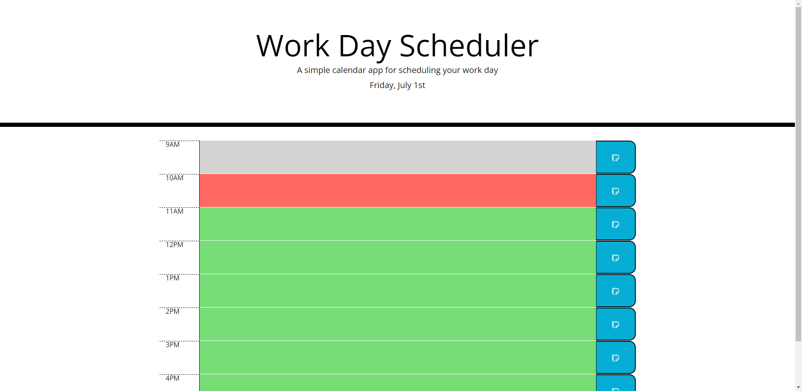
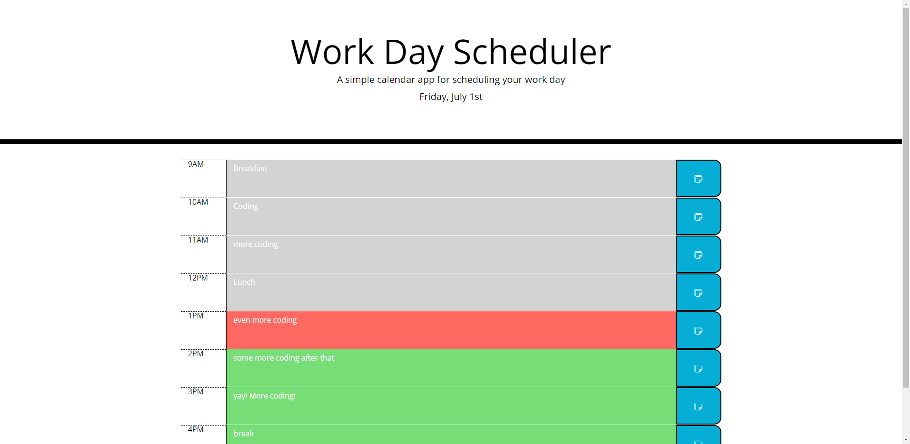

# 05 Third-Party APIs: Work Day Scheduler

## Instructions

The user may input data into the text areas. When they hit the save button, the data will be stored and held in their browser.

## Appearance

This application has a banner at the top which includes an element that will update to match the current date

there are time blocks that have labels to indicate the time that they represent. These blocks have areas that can hold text that the user input. There is a blue Save button beside this text area. The text areas will update according to the current time to display whether they are in the past, present, or future.

## Interface

## Github Pages

https://alkarias.github.io/charles_morton_planner/